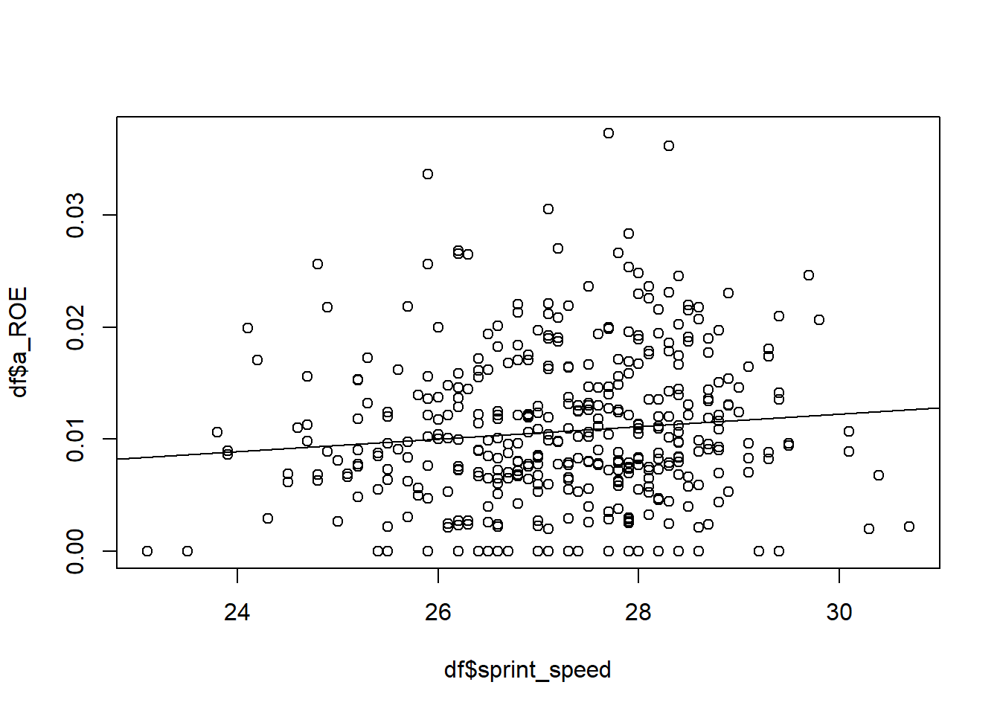

# Causal Baseball: The Case of Reach on Error 

### Abstract

Data Science in baseball is a widely spread field in which many different metrics and approaches have been developed, particularly in the last 20 years, to analyze and evaluate the performance of players and teams on the field. This field of data analysis in baseball is called Sabermetrics.

The boundaries are not always entirely conclusive, and for some relationships, the question of actual meaningfulness can arise.

In the following example, we aim to highlight the effect of a player's attributes, such as their speed or hitting technique, on their Reached on Error (ROE) numbers.

Reached on Errors is a somewhat overlooked value in Sabermetrics when evaluating player performance. In general, an offensive player (called a Hitter) receives an ROE when they reach a base due to a defensive error that they would not have reached without the error. An error can be, for example, a bad throw, bad fielding (poor ball retrieval), or dropping the ball. By definition, errors and bases reached due to errors are a product of a defensive player's mistakes.

With this data product we want to perform empirical evidence on the following quote stated on [mlb.com](https://www.mlb.com/glossary/standard-stats/reached-on-error)

> “By definition, errors are primarily the result of a fielder making a mistake. But even with that caveat, certain players -- namely speedy ground-ball hitters -- are likely to record more times reached on error than the average player.” - mlb.com

### Current State and Call for Extension

Currently, we investigated the causal relationships of the underlying problems using DAGs. We downloaded data from [mlb.com](https://www.mlb.com/) and think our data product could be further developed in terms of

* Careful analysis of the data
* Evidence on causal relationships and assumptions 
* Formulation of testable hypotheses
* Identification approach: Is there a way to provide empirical evidence on the causal relationship stated above? Can we find an instrumental variables or use other quasi-experimental methods?

